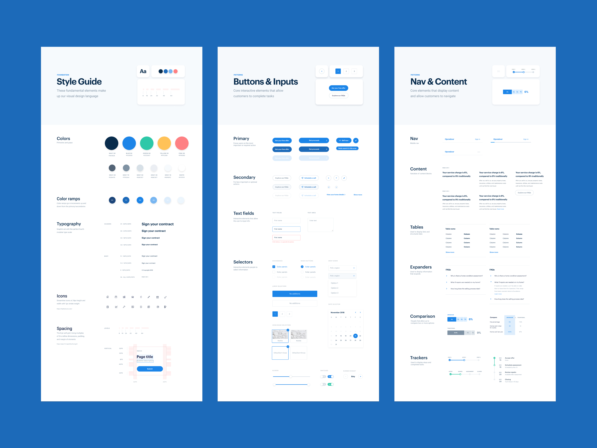
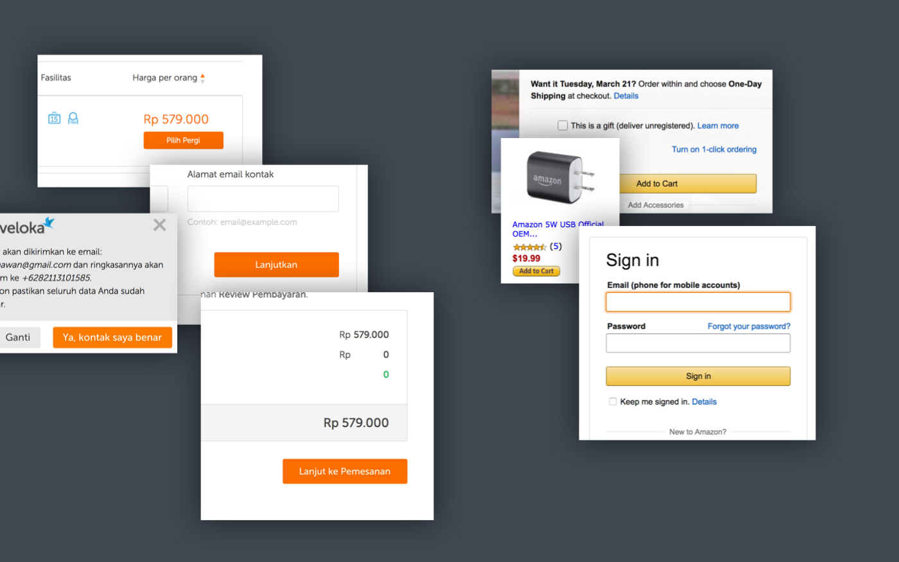
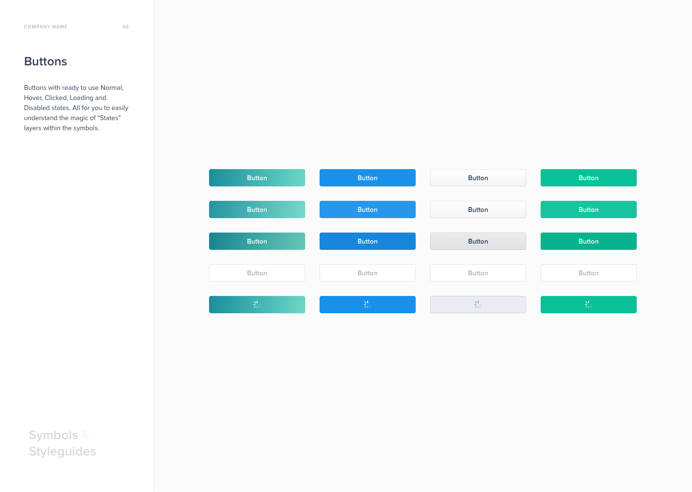
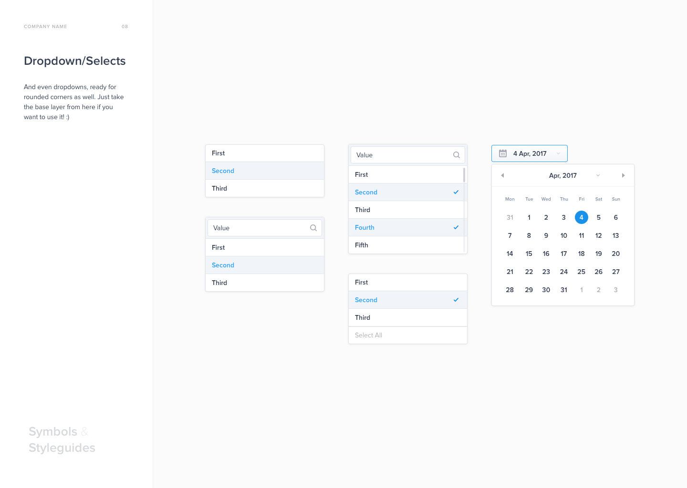
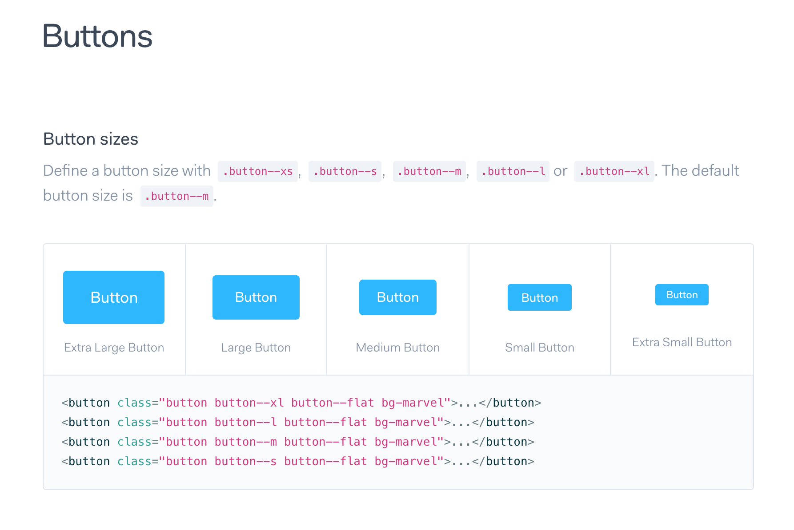

### Daftar Isi
[Tampilan UI Giudline](Tampilan-UI)

## Tampilan UI Guideline
berikut adalah contoh UI yang saya dapat dari [Allen Jordan](https://dribbble.com/shots/6419510-ODS-v1-Consumer-Design-System) dari akun dribbble-nya

 

Jadi apa itu UI Guideline?
Sebuah dokumen yang berisi aturan aturan dalam mendesain suatu produk digital. Aturan aturan tersebut diantaranya:

+ Daftar warna warna yang bisa digunakan
+ Daftar font yang bisa digunakan
+ Ukuran font yang bisa digunakan
+ Bentuk, warna dan ukuran tombol
+ Bentuk input teks
+ Bagaimana menampilkan pesan error pada input teks
+ Bagaimana warna button jika di hover atau saat di klik
+ Bagaimana ukuran font saat digunakan sebagai heading atau saat digunakan sebagai teks di suatu paragraf
+ Bagaimana jarak antar elemen, Dan masih banyak lagi...

## Mengapa harus menggunakan UI Guideline?
Alasan yang paling utama adalah menjaga konsistensi elemen elemen dari sebuah produk digital. UI Guideline bisa dikatakan sebagai Single Source of Truth atau sebuah pedoman. Jika seorang designer menemukan beberapa design yang tidak konsisten, designer tersebut bisa membuka UI Guideline untuk mencari tahu mana yang benar.

Contohnya:
>Andi sedang memeriksa hasil design dari team nya. Saat itu mereka sedang mendesain alur pembelian barang. Di halaman pertama, Andi melihat tombolnya berwarna hijau. Di halaman kedua, Andi melihat tombol nya berwarna orange.
>Karena mengalami hal tersebut, Andi lantas membuka UI Guideline dan mencari tahu bagaimana bentuk, ukuran dan warna tombol yang harus digunakan.

## Apa keuntungan menggunakan UI Guideline?
#### 1. Konsistensi di semua halaman sebuah produk digital bisa terjaga
Bayangkan jika kamu menggunakan sebuah app untuk mencari tiket pesawat. Pada halaman awal, tombol pencarian nya berwarna hijau. Lalu pada halaman berikutnya tombol pemesanan nya berwarna orange. Bingung enggak?
Dengan ada nya UI Guideline, hal ini tidak akan terjadi.
Konsistensi cukup penting dalam sebuah produk digital. Karena dengan konsistensi, user akan lebih mudah untuk mengenali sebuah elemen.
>Contohnya… jika dari awal tombol pencarian nya atau tombol utama nya berwarna hijau, maka di halaman halaman selanjut nya user tinggal mencari sebuah tombol berwarna hijau untuk melanjutkan prosesnya.
Contoh konsistensi dalam penggunaan tombol :

Membuat user mudah mengenali mana elemen tombol untuk melanjutkan proses

#### 2. Workflow atau kinerja menjadi lebih cepat
Tidak perlu lagi memikirkan…
>“Eh tombol untuk CTA bentuknya gimana ya tadi?”
>“Tombol Cancel baiknya seperti apa ya?”
>“Tombol di pop-up seperti apa ya bagusnya?”
Semua nya sudah terdokumentasikan secara jelas, sehingga cukup mengikuti aturan nya saja.

Contoh Guideline sebuah tombol yang bisa mempercepat kinerja seorang designer :

#### 3. Designer bisa lebih fokus ke pembuatan solusi
Karena semua elemen sudah terdokumentasi, maka tidak perlu lagi untuk memikirkan…
>“Bentuk dropdown nya seperti apa ya?”
>“Dropdown nya bagus dikasih border atau enggak ya?”
>“Tinggi dropdown nya seberapa ya? , apakah mau setinggi tombol utama?”
Karena hal hal tersebut sudah terdokumentasikan, designer bisa fokus ke hal hal yang lebih penting seperti:

>+ Pembuatan layout
>+ Cara menampilkan informasi di sebuah halaman

Tanpa perlu memikirkan detail kecil seperti ukuran teks dan tinggi button.

Contoh Guideline untuk elemen dropdown

#### 4. Membantu Developer dalam implementasi design ke dalam bentuk code
Dengan ada nya guideline, maka design sebuah produk digital akan menjadi konsisten, hal ini akan berdampak juga pada developer. Mereka akan lebih mudah mengimplementasi design dari designer.

>Contohnya… Karena tombol utama nya sudah terdapat UI Guideline nya mulai dari warna nya, bentuknya, ukuran teks nya, maka developer bisa membuat sebuah class untuk tombol utama tersebut. Dan jika developer tersebut sedang mendevelop halaman lain yang terdapat tombol utama nya, mereka tidak perlu mengukur tinggi tombol tersebut, dan mencari tahu warna nya apa. Mereka cukup menggunakan class yang telah mereka buat sebelumnya.

Contoh sebuah class untuk tombol
 	
 
## Kapan harus membuat UI Guideline?
Ini sangat bergantung pada kondisi masing masing.
Ada perusahaan yang membuat UI Guideline dari awal untuk memastikan proses design sebuah aplikasi berjalan lancar dan elemen nya konsisten. Ada perusahaan yang ngejar cepet, pokoknya jadi dulu aja. Jika ada yang enggak konsisten enggak apa apa. Bikin guideline nya bisa nanti nanti saja.
Menurut saya pribadi, kita harus mulai untuk membuat UI Guideline jika…
> 1. Terdapat banyak sekali halaman pada sebuah produk digital tersebut baik web maupun app.
Sehingga jika kita sedang mendesain halaman pengisian form, kita tidak perlu mencari cari halaman lain yang memiliki design form hanya untuk mencari tahu bentuk form seperti apa. Kita cukup membuka guideline untuk mencari tahu bentuk form nya.
> 2. Banyak designer yang mengerjakan design sebuah produk digital
Bayangkan jika ada 4 designer yang mengerjakan sebuah produk digital. 
Sebutlah Andi, Budi, Toni dan Ria. Andi membuat design tombol utama warna hijau. Lalu Budi karena suka Manchester United bikin design tombol utama warna merah, Toni dan Ria punya warna favorit sendiri, sehingga mereka memberi warna tombol utama sesuai warna favorit mereka. Repot kan?
Dengan ada nya guideline, bentuk tombol utama, warna pada tombol utama, ukuran teks pada tombol utama akan tetap sama di semua halaman walaupun yang mengerjakan nya ada 4 designer.

[Lanjut ke artikel berikutnya..]

 
