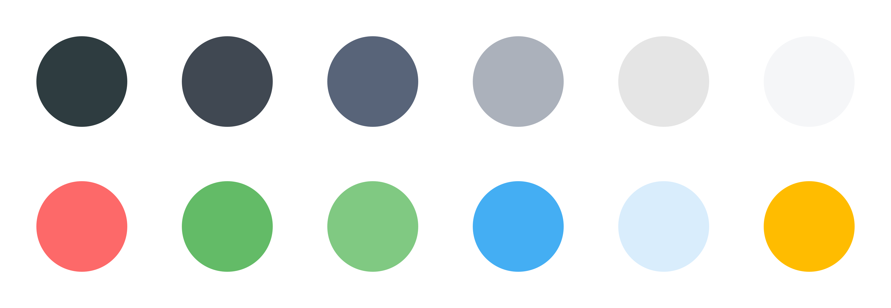
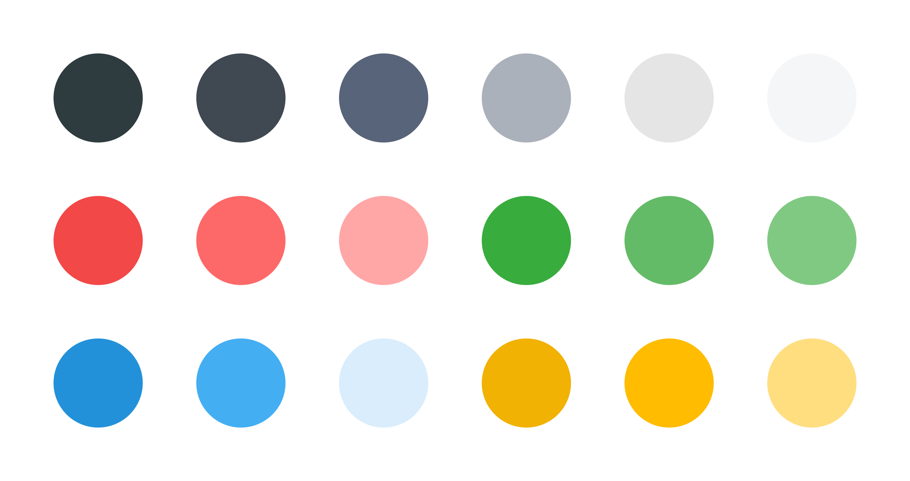
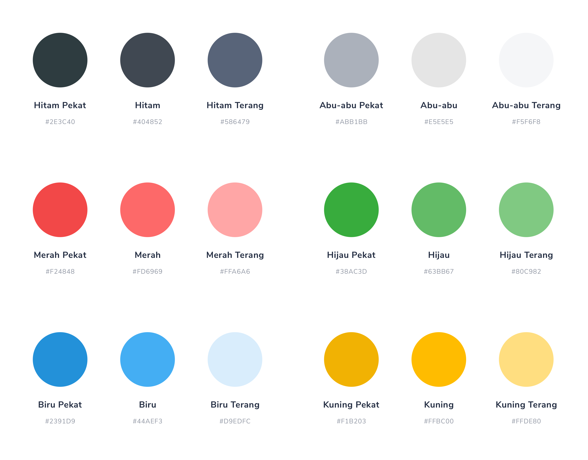
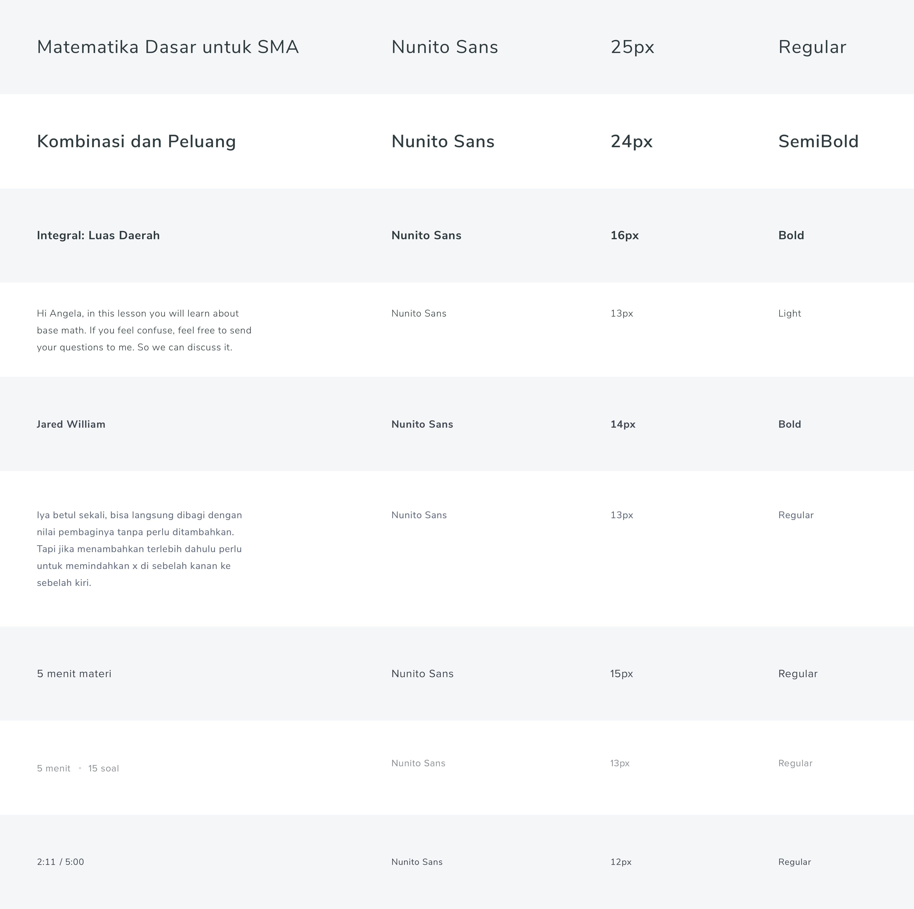
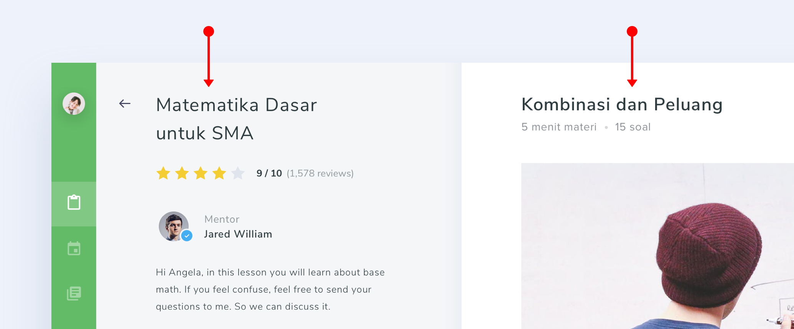
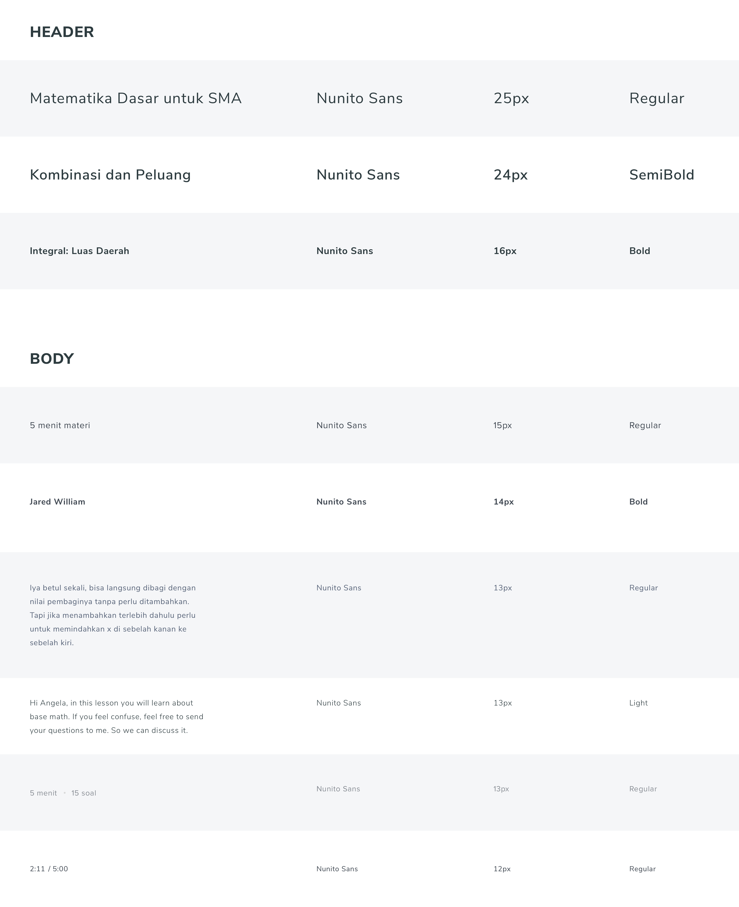
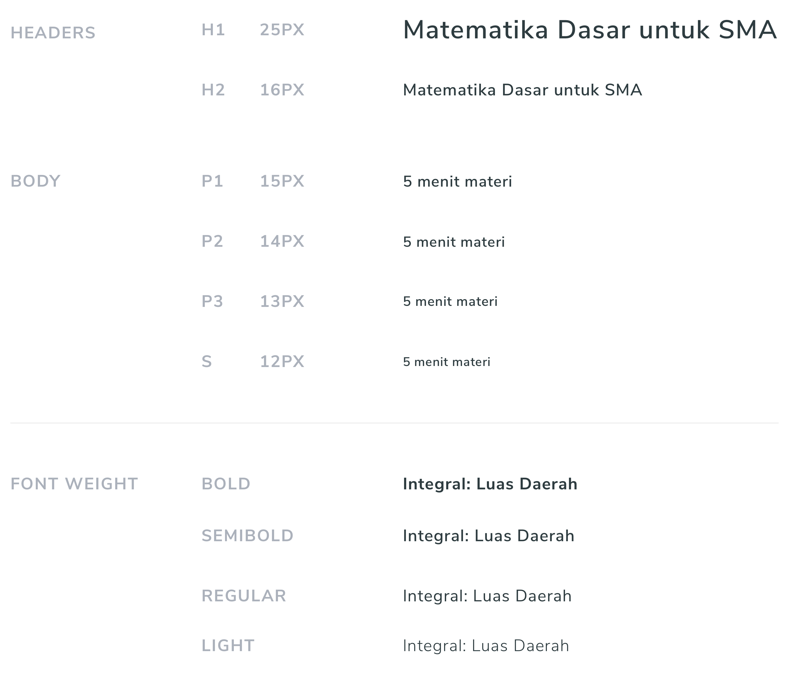

### Daftar Isi
[1. Color (Warna)](#1-color--warna-)
[2. Typography](#2-typography) 

Ini adalah artikel lanjutan mengenai UI Guideline. Artikel sebelumnya bisa disimak [disini](./about-guideline-1.md)
Pada bagian ke-2 ini kita akan membahas beberapa hal berikut:
+ Bagaimana membuat UI Guideline?
+ Membuat UI Guideline untuk Warna
+ Membuat UI Guideline untuk Typography
Mari kita mulai…

#### Bagaimana membuat UI Guideline?
Sebelum membuat UI Guideline, mari kita pahami kembali apa fungsi UI Guideline, yaitu memandu kita saat membuat sebuah design. Memandu dalam hal apa?
+ Memandu seorang designer dalam membuat tombol
+ Memandu seorang designer dalam menggunakan font
+ Memandu seorang designer dalam menggunakan warna

#### Jadi kita bikin UI Guideline terlebih dahulu sebelum membuat sebuah design?
Karena UI Guideline adalah sebuah panduan, rasa rasa nya lebih pas kalau kita bikin UI Guideline nya terlebih dahulu baru membuat design UI nya. Terasa masuk akal, tapi coba kita telaah… “Bagaimana mungkin kita bisa membuat aturan bahwa ukuran teks sebesar 20px cocok digunakan sebagai heading sementara kita belum pernah mengimplementasikan nya ke dalam sebuah design UI?”

#### Jadi bikin design UI nya terlebih dahulu?
Kalau menurut saya, Iya.

#### Lalu bagaimana memulai nya?
Buat 3–4 halaman design UI terlebih dahulu
+ Coba semua font yang menurutmu bagus.
+ Coba semua ukuran font yang menurutmu cocok dan enak dibaca
+ Untuk warna, Jika kamu mengerjakan project klien maka ikuti brand color nya. Lalu tambahkan beberapa warna yang menurutmu bisa sesuai dengan brand color nya.
+ Coba eksplorasi bentuk tombol yang menurutmu bagus seperti apa

Setelah membuat beberapa design, kita bisa mulai membuat UI Guideline dimulai dari beberapa hal berikut…

### 1. Color (Warna)
Mari membuat daftar warna apa saja yang digunakan. Dari design diatas, berikut adalah warna yang digunakan

Setelah membuat daftar warna yang digunakan, kita bisa melihat bahwa untuk warna hitam, terdapat 3 warna yang berbeda
+ Hitam Pekat
+ Hitam Normal
+ Hitam Terang
Dan untuk warna abu abu juga terdapat 3 warna yang berbeda
+ Abu abu Pekat
+ Abu abu Normal
+ Abu abu Terang
Untuk warna biru, baru terdapat 2 warna yang berbeda
+ Biru Normal
+ Biru Terang
Untuk Hijau, baru terdapat 2 warna yang berbeda
+ Hijau Normal
+ Hijau Terang
Sampai di tahap ini kita bisa menyimpulkan bahwa untuk sebuah warna kita membutuhkan 3 macam warna yaitu Pekat, Normal dan Terang.
Melihat kebutuhan tersebut kita bisa menyediakan 3 tingkat untuk setiap warna. Sehingga UI Guideline untuk warna menjadi seperti berikut…

Setelah itu kita beri nama dan beri keterangan hexa code nya agar lebih jelas, sehingga menjadi seperti dibawah ini…

#### Bentar… Itu warna merahnya kok sudah ada versi terang dan pekat nya? gimana cara menentukan nya?
>Tenang, untuk daftar warna nya ini hanya sementara, masih bisa mengalami perubahan seiring banyak nya halaman halaman yang dibuat. Jadi warna merah pekat yang kita tentukan sekarang bisa saja berubah ketika setelah dicoba pada suatu design ternyata warna nya perlu yang lebih pekat lagi.
>Jadi bisa dikatakan warna merah pekat dan terang adalah warna yang akan kita ujikan pada design yang akan kita buat nanti nya.
#### Apakah untuk daftar warna nya ini sudah tidak bisa diubah lagi?
>Tentu bisa, UI Guideline adalah living document, Jadi UI Guideline adalah sebuah dokumen yang bisa mengalami perubahan sesuai dengan kebutuhan dari produk tersebut.
>Jadi misal neh.. suatu hari sedang membuat fitur notifikasi. Lalu di setiap notifikasi nya butuh warna warna yang unik. Maka kita bisa mendiskusikan kemungkinan untuk menambahkan warna pada UI Guideline dengan rekan rekan designer lain nya.
#### Jadi selama belum ada kebutuhan untuk menambah warna lain, Maka selama membuat design halaman berikutnya, warna yang bisa digunakan hanya warna ini ya?
>Betul Sekali

### 2. Typography
Selanjutnya kita akan membuat aturan dalam penggunaan font, ukuran font, ketebalan font dan segala hal yang berhubungan dengan penggunaan teks di dalam produk yang kita rancang.
Kita mulai dari membuat daftar semua ukuran teks yang digunakan pada design di atas, berikut hasilnya…

Coba perhatikan 2 baris pertama pada tabel diatas 👆, sama sama digunakan untuk header di tempat yang hampir sama tetapi terdapat perbedaan ukuran huruf dan ketebalan huruf.

Itu adalah salah satu hal kecil jika kita tidak menggunakan guideline. Akan ditemukan berbagai macam ukuran font.
Dari data diatas, kita bisa membuat UI Guideline untuk typography dengan membuat 2 kategori, font yang digunakan untuk header dan font yang digunakan untuk body
Sehingga urutan nya menjadi seperti ini….

Dari pengurutan di atas, didapatlah ukuran font yang sering digunakan sebagai berikut…
#### Header
+ 25px
+ 24px
+ 16px
#### Body
+ 15px
+ 14px
+ 13px
+ 12px
Untuk ukuran header 24px bisa kita hilangkan, karena penggunaan nya di tempat yang hampir sama dengan ukuran header 25px

Sehingga ukuran ukuran font yang digunakan menjadi seperti berikut…
#### Header
>25px
>16px
#### Body
+ 15px
+ 14px
+ 13px
+ 12px
Setelah itu kita menganalisa ketebalan font yang sering digunakan, dari data diatas, ketebalan font yang sering digunakan adalah:
+ Bold
+ Semibold
+ Regular
+ Light
Ketebalan font ini juga bisa kita masukkan ke dalam UI Guideline, sehingga memberi informasi ketebalan font seperti apa yang bisa digunakan
Setelah itu, kita bisa membuat dokumentasi UI Guideline untuk typography seperti dibawah ini

Setelah UI Guideline untuk Typography selesai, maka ketika kita akan membuat design UI untuk halaman berikutnya, semua penggunaan teks harus mengacu pada dokumen diatas. Tetapi jika memang dirasa dibutuhkan untuk menambahkan ukuran teks, maka yang pertama harus dilakukan adalah berdiskusi dengan team design.
Atau jika kamu adalah satu satu nya designer di project tersebut, maka pertimbangkanlah dulu untuk menggunakan ukuran font yang tersedia, jika sudah mencoba dan masih dirasa butuh menambah ukuran font, maka tambahkanlah.

[Lanjut ke artikel berikutnya..](./colors-and-typography.md)

 

