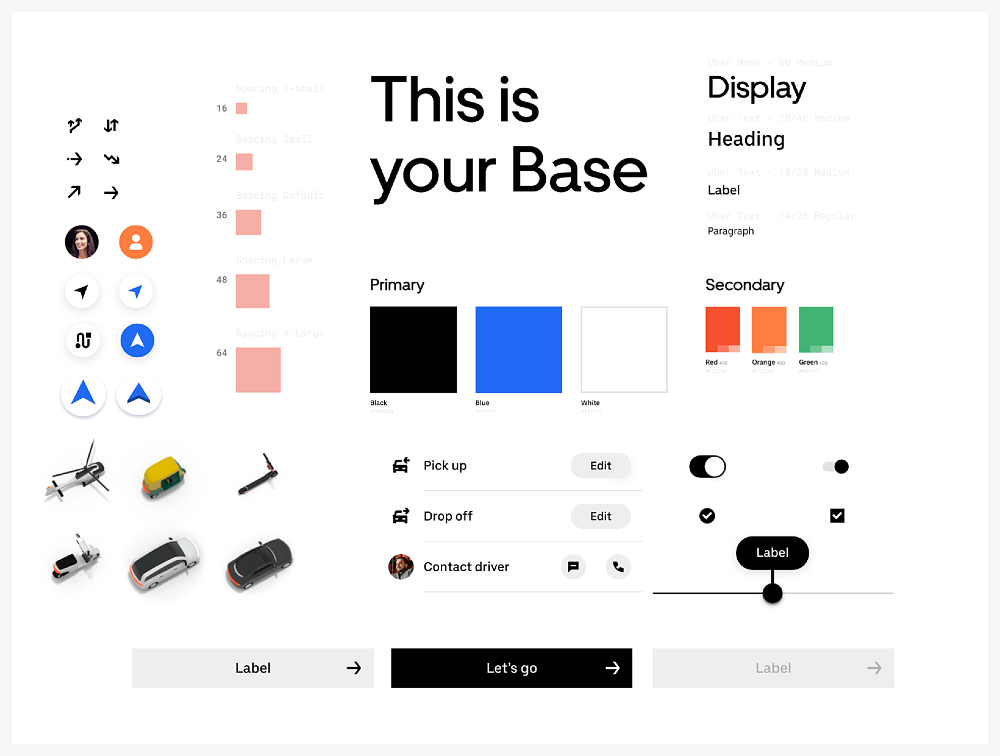

### Daftar Isi
- [Apa itu Margin?](#apa-itu-margin-)
  * [Seperti apa guideline untuk margin?](#seperti-apa-guideline-untuk-margin-)
- [Kenapa margin harus diberi aturan?](#kenapa-margin-harus-diberi-aturan-)
  * [Dari mana kita memulai nya?](#dari-mana-kita-memulai-nya-)
  * [Bagaimana Implementasi nya?](#bagaimana-implementasi-nya-)

###### <small><i><a href='http://ecotrust-canada.github.io/markdown-toc/'>Table of contents generated with markdown-toc</a></i></small>

Ini adalah artikel lanjutan mengenai UI Guideline. Artikel sebelumnya bisa disimak [disini](./colors-and-typography.md) , Pada bagian ke-3 ini kita akan Membuat UI Guideline untuk Margin
Sebelum kita mulai, mari kita melihat design yang telah dibuat
 

Pada artikel sebelumnya, kita telah membuat aturan mengenai Warna dan Typography. Kini kita akan membuat aturan atau guideline mengenai penggunaan margin.

### Apa itu Margin?
Adalah jarak antar elemen.
+ Jarak tombol dengan teks di dekatnya
+ Jarak Title dengan deskripsi
+ Jarak gambar dengan judul
+ dll

#### Seperti apa guideline untuk margin?
Mari kita lihat beberapa guideline yang terdapat aturan penggunaan margin di dalamnya

source: [https://dribbble.com/shots/6964917-Uber-s-Design-System-Base](https://dribbble.com/shots/6964917-Uber-s-Design-System-Base) 

source: [https://marvelapp.com/styleguide/design/layout](https://marvelapp.com/styleguide/design/layout) 

source: [https://primer.style/css/utilities/margin](https://primer.style/css/utilities/margin) 

### Kenapa margin harus diberi aturan?
terdapat beberapa keuntungan dengan membuat aturan ataupun guideline untuk margin:
+ Konsistensi
+ Mempercepat proses design, karena seorang designer tidak perlu lagi mempertimbangkan akan menggunakan margin 16px, 15px ataupun 17px
+ Mempercepat proses development, karena seorang developer tidak perlu mencari tahu jarak margin yang digunakan oleh sang designer. Jika aturan penggunaan margin telah di definisikan, maka seorang developer cukup dengan melihat design dan bisa langung menentukan akan menggunakan margin yang mana.

#### Dari mana kita memulai nya?
Jika sebelumnya kita membuat UI Guideline untuk Colors, Typography dengan membuat UI nya terlebih dahulu, maka untuk margin bisa kita definisikan aturan nya sebelum membuat UI nya, lalu setelah di definisikan bisa diuji coba pada beberapa design lalu dilakukan review apakah cocok atau tidak.
Beberapa metode yang bisa digunakan dalam mendefinisikan aturan margin:
+ Penggunaan margin adalah kelipatan 4px. Sehingga margin yang bisa digunakan adalah 4px, 8px, 12px, 16px, dst….
+ Penggunaan margin adalah kelipatan 8px. Sehingga margin yang bisa digunakan adalah 8px, 16px, 24px, 32px, dst….

#### Bagaimana Implementasi nya?
Mari kita implementasikan margin dengan kelipatan 4px pada design yang telah dibuat
Berikut adalah daftar margin yang akan kita pakai

Dan berikut implementasi pada design nya

Dengan membuat guideline untuk margin, seorang designer bisa menjadi lebih cepat dalam proses design nya, karena ia dengan cepat memutuskan untuk menggunakan margin yang mana.
Dengan membuat guideline untuk margin, seorang developer bisa lebih cepat dalam proses coding nya, Ia tidak perlu mencari tahu margin yang digunakan oleh sang designer, karena semua margin telah terdefinisikan.
Berlanjut ke artikel selanjutnya

-------

[Lanjut ke artikel berikutnya..](./guideline-bagian3.md)

 

<small><i><a href='http://ecotrust-canada.github.io/markdown-toc/'>Table of contents generated with markdown-toc</a></i></small>
